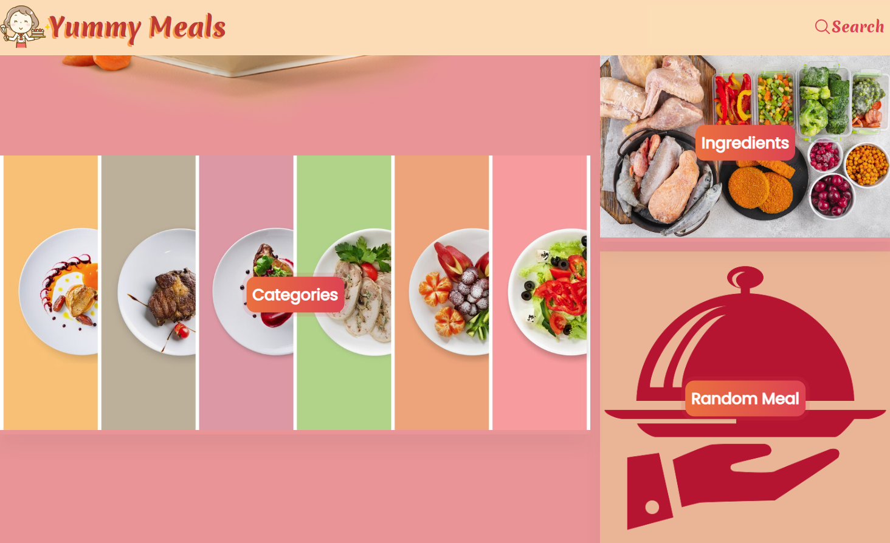

    

# Yummy Meals
Yummy meals is a platform to what recipes from many parts of the world. You can choose your favorite recipe to cook your meal.

# 🚀 Demo
Here is a quick demo of the app. We hope you enjoy it.

> [The Demo Link](https://yummy-meal-react.vercel.app/)

Liked it? Please give a ⭐️ to <b>Yummy Meals</b> to build its triceps 💪 stronger.

# 🔥 Features

- Main page with ingredients and categories

  

- Ingredients page
- Meals page

# 💾 API
This app is using the:
> [TheMealDB API](https://www.themealdb.com/api.php)